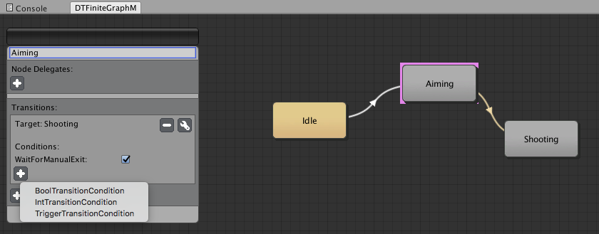

# finite-graph-machine
My attempt at building a finite state machine in Unity3D, inspired by the Animator. Not 100% feature complete.

I stopped working on it because even though making logical state machines with the animator is full of landmines and potential problems, the animator gives you 90% of functionality that you need without the context switching cost of having two similar, yet different systems.

Demo scene is included.

### Features
* Complete separation of logic and editor
* Full test-suite
* Nodes, Transitions
* Supports multiple active nodes

### Planned Advantages Over Animator
* Better node querying system (ex. GetComponentsInChildren<T>() equivalent for sub-state machines)
* No animation concepts as point of failures (ex. Transition Duration)
* Instantaneous transitions

### Dependencies
* Must import Unity Test Tools from the asset store into your project
